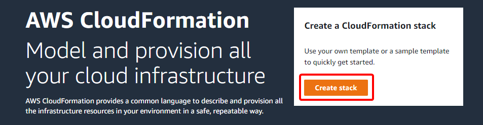
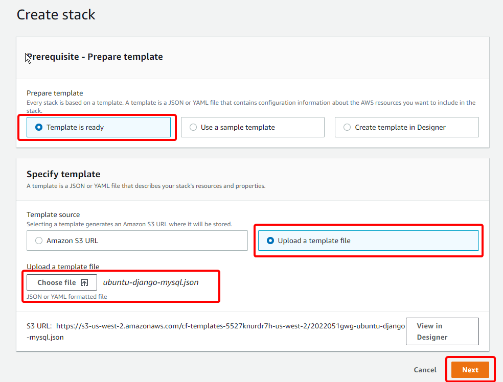
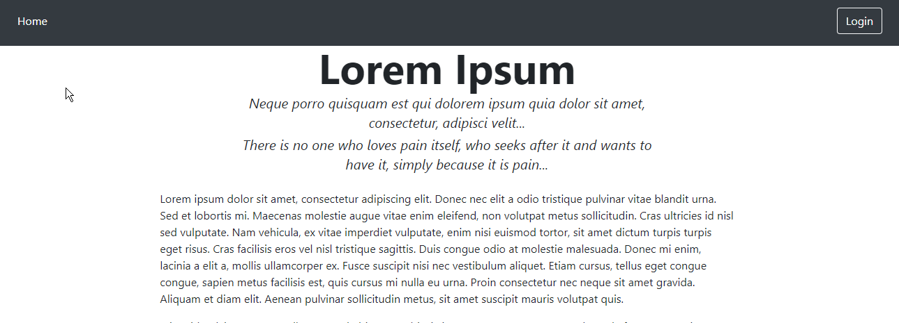
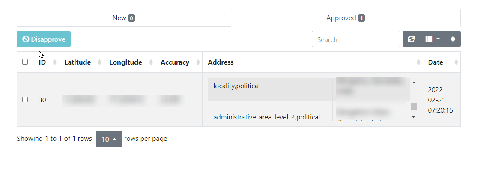

# Sample IaC Django application

Sample Django application demonstrating the following:

- IaC (Infrastructure as Code): uses AWS Cloudformation to setup and
  configure the server.

- Uses Geolocation API to capture and save the location to a MySQL
  database.

- Uses Google Maps API to fetch the location address based on latitude
  and longitude, and saves it to the database.

- IaC sets up a self-signed SSL certificate since Geolocation API
  requires SSL. Cannot use LetsEncrypt here since they do not provide
  SSL certificate for an IP address.

- Provides an admin page for an administrator to view and approve
  collected locations.

- Uses an NGINX server with a python/django backend.

## Get Started

Here is the full procedure to get the application running on AWS.

- Download and save the AWS Cloudformation JSON file
  `ubuntu-django-mysql.json`.
  
- Navigate to [the AWS Clouformation
  console](https://us-west-2.console.aws.amazon.com/cloudformation/home)
  
- Click on "Create Stack" at the top right on the console.
  
  
- Make selections as shown and upload the Clouformation JSON file and
  click "Next" to continue.
  
  
- Specify the parameters to the Clouformation stack:

    * Enter a name such as `django-sample` for the stack name.
	
	* Enter values for following parameters:
	
		+ **DBName** is the name of the MySQL database to create.
		
		+ **DBUsername** is the MySQL database username.

		+ **DBPassword** is the password for the MySQL database user
          specified above.

		+ **SiteAdminUsername** is the name for the site admin user
          (also the django superuser).
		  
		+ **SiteAdminPassword** is the password for the site admin.
		
		+ **SiteAdminEmail** is required to create the site admin
          user.
		  
		+ **GoogleMapsAPIKey** is required to retrieve the location
          address from the latitude and longitude. Create one if you
          don't already have it.
		  
		+ **InstanceType**: pick the AWS EC2 instance type you need. A
          `t1.micro` will suffice.
		  
		+ **KeyName**: pick a suitable AWS SSH key-pair from your
          account. Create one if you don't have it.
		  
		+ **SSHLocation** is used to retrict SSL access to the
          instance.
		  
	* Once these are entered, click "Next".

	* Configure stack options: you can just leave it at the
      defaults. Click Next now.
	  
	* And that's it. Click "Create stack" to complete the
      creation. Once it is finished you will have an EC2 instance with
      NGINX, a MySQL database and the Django application running on
      it.

	* As a part of creating the stack, the code will be fetched from
      github and installed as a Django application.

- Navigate to your instance hostname (or IP) using your browser. You
  will get an SSL warning that the certificate is not valid since it
  is a self-signed certificate. Ignore the error and continue to the
  website.
  
- The website looks like the following image. The text is generic text
  and intended for demonstration.
  

- An alert should pop up asking for your permission to allow the
  website to fetch your location. Once it is allowed, the location
  will be saved to the database.

- To view the admin page where you can approve/disapprove users, click
  the "Login" button. Login with the credentials you specified earlier
  when you created the AWS stack. You will be taken to the Admin site.
  
